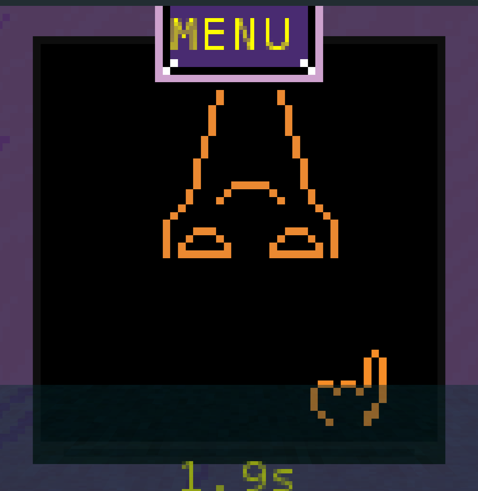

# Ludumdare 37

Game [submission](http://ludumdare.com/compo/ludum-dare-37/?action=preview&uid=55843) made for the 37th [Ludum Dare](https://ldjam.com/) game jam in collaboration with [Gab](https://github.com/bathdrone). The gameplay is reminiscent of WarioWare with a dark tone to it.

Try to win minigames in your waterproof tv to prevent the water from entering your submerged capsule and drowning you.

## Playing the Game

You can download the .jar [here](https://hollowbit.net/play/ld/37/game.jar) (Warning: download starts immediately), or you can build it yourself:

1. Make sure you have JDK 8 installed, with JAVA_HOME pointing to it. NOTE: This project uses an older gradle version that does not support Java 9+

2. Then simply execute the gradle script

```
$ ./gradlew desktop:run
```

## Screenshots



